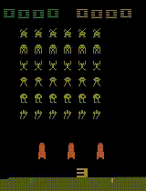

# OpenAI_Gym_Atari_Space_Invaders_RL

> About

- Space Invaders agent trained using DQN/A2C models on OpenAI Gym Atari Environment.

> Demo

- Best performing variant (trained on A2C algorithm).

> Trained Models

- [dqn_space_invaders_epochs_50.h5](https://drive.google.com/file/d/1eR3zSHc4e8dKRVRD7iiLvT-d4CobWRWD/view?usp=sharing)
- [a2c_actor_model_space_invaders_epochs_50.h5](https://drive.google.com/file/d/1g3vyV4eGafc8tdtuE_6byHn07xQXmtBl/view?usp=sharing)
- [a2c_critic_model_space_invaders_epochs_50.h5](https://drive.google.com/file/d/1O-Iugg6gsNzIxNY8N2kym-aXC3WPldu-/view?usp=sharing)
